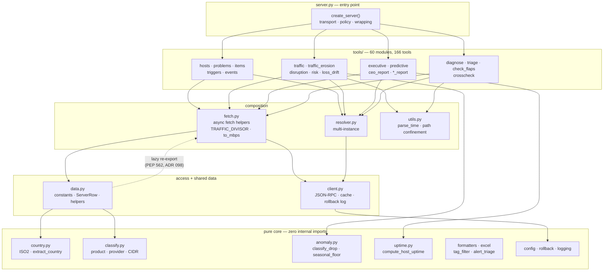
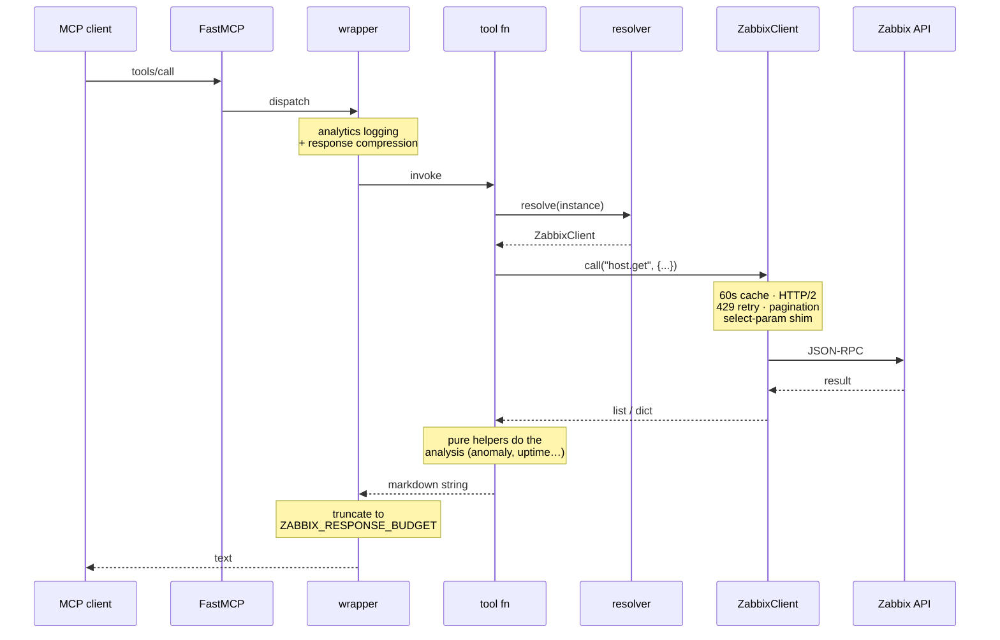
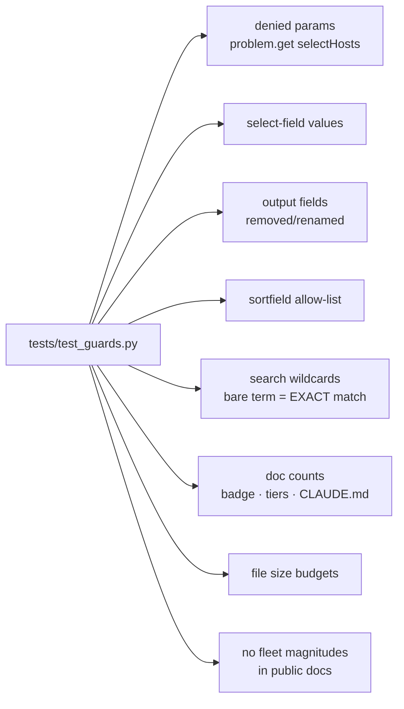

# Architecture

zbbx-mcp is a Zabbix MCP server: **166 tools across 60 tool modules**, backed by
a small pure core. Python 3.10+, FastMCP, async httpx with HTTP/2.

Everything below was derived from the source, not from memory — the layering
claims are checked by the import rules in [§4](#4-import-rules-enforced).

---

## 1. Layers

Strict one-way dependency flow. Nothing in a lower layer imports from a higher
one.

The dotted edge is the one cycle in the graph, and it is deliberate: `data`
re-exports `fetch`'s helpers for backwards compatibility. Resolving that
eagerly made `import zbbx_mcp.fetch` **fail outright** when it happened to be
imported first — it only ever worked because every entry point imported `data`
first. It is now resolved lazily through a module `__getattr__`, so there is no
import-time edge at all (ADR 098/100).

---

## 2. Request lifecycle

Every tool returns a **string**, never a structure — the response *is* the
rendering. That is why formatting decisions (what to omit, what to label
"unknown") are correctness decisions here, not cosmetics.

---

## 3. Cross-cutting concerns

| Concern | Where | Note |
|---|---|---|
| **Read-only mode** | `tools/__init__.py` | `WRITE_TOOLS` blocklist; `ZABBIX_READ_ONLY=1` skips registration entirely |
| **Tiers** | `tools/tiers.py` | `ZABBIX_TIER` = core/ops/finance/reports/full — prunes `tools/list` to cut handshake cost |
| **Response budget** | `server.py` | `_compress_response`, default 6000 chars |
| **Rollback** | `client.py` + `rollback.py` | pre-mutation snapshots; `rollback_last` / `rollback_by_index` |
| **Cache** | `client.py` | 60s TTL on host/project lookups |
| **Multi-instance** | `resolver.py` | `ZABBIX_INSTANCES`, per-tool `instance=` arg |
| **Path confinement** | `utils.py` | caller-supplied paths realpath'd against an allowlist (ADR 076) |
| **Traffic units** | `fetch.py` | one `TRAFFIC_DIVISOR` + `to_mbps`/`to_kbps`/`from_mbps` (ADR 087/098) |

---

## 4. Import rules (enforced)

1. `classify.py` must not import from `tools/` — it is imported *by* the shared
   data layer, so a back-edge would create a real cycle.
2. `data.py` ↔ `fetch.py` re-exports are lazy (§1).
3. Pure modules (`anomaly`, `uptime`, `country`, `formatters`, …) import nothing
   from this package. This is what makes the analysis logic unit-testable
   without a Zabbix instance — and most defects found in review lived in the
   *wiring* around them, not in the pure functions.

---

## 5. The test layer is part of the architecture

891 tests. Three kinds, and the third is the interesting one:

- **pure tests** — the analysis functions, no I/O.
- **wire-contract tests** (`tests/wiretest.py`) — drive a real tool through a
  recording fake client and assert the exact API calls. Pure-core tests alone
  shipped two live `-32602` bugs, because the defect was in the request, not
  the maths.
- **AST guards** (`tests/test_guards.py`) — scan the source and fail the suite
  on classes of mistake that are invisible at runtime until they reach
  production:

Each guard exists because that exact mistake shipped once. They encode the
dominant failure mode of this codebase: **not crashes, but confident wrong
answers** — a removed field that Zabbix silently ignores, a search term that
matches nothing, a column that can only ever read zero. An error gets
investigated; a plausible number gets quoted.

---

## 6. Adding a tool

1. `@mcp.tool()` async function inside `register()` in the right `tools/*.py`
2. gate with `if "tool_name" not in skip:`
3. mutating? add to `WRITE_TOOLS`
4. add to `EXPECTED_TOOLS` (`tests/test_registration.py`) and bump the count in
   `tests/test_server.py`
5. update README counts + the CLAUDE.md header — the doc guard pins them
6. prefer a wire-contract test over a pure one if it calls the API
7. `uv run pytest`
